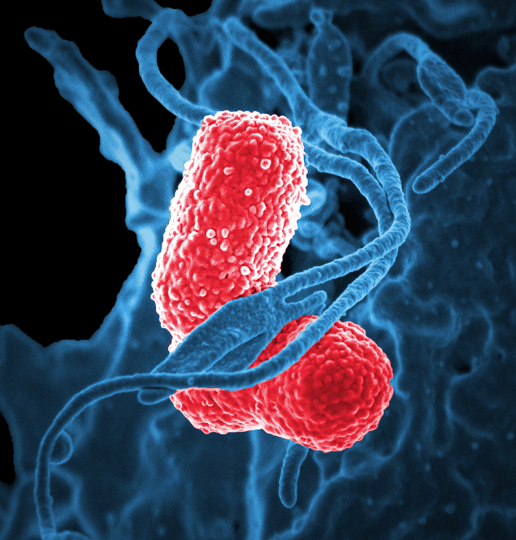
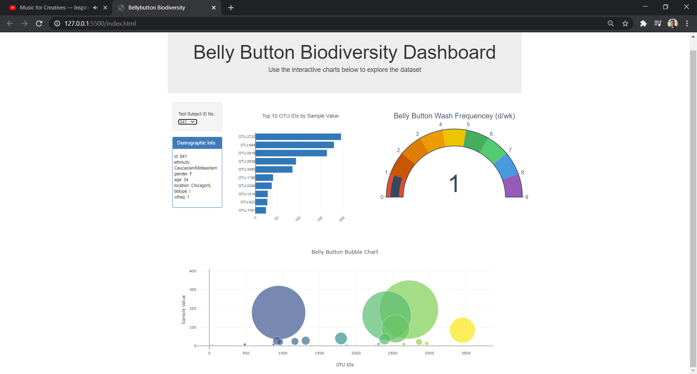

# ploty-challenge

---
## Background & Challenge
Build and interactive dashboard to explore the [Belly Button Biodiversity Dataset](http://robdunnlab.com/projects/belly-button-biodiversity/), which catalogs the microbes that colonize human navels.

The dataset reveals that a small handful of microbial species (also called operational taxonomic units, or OTUs, in the study) were present in more than 70% of people, while the rest were relatively rare.

[Follow this link to interactive dashboard](https://gabeo13.github.io/ploty-challenge/)

---
## Dashboard Development Toolkit

>* JavaScript
>* d3.js
>* Plotly.js
>* GitBash
>* github pages
>* HTML
>* CSS
>* JSON Backend
---
## Operating Instructions
1. Clone repository to desired location while maintaining directory paths. 

2. **Local Server** *Recommended* : Open reposity with VS Code, and initialize a local server from the index.html file using the [LiveServer](https://marketplace.visualstudio.com/items?itemName=ritwickdey.LiveServer) extension.

3. **Local Server** *Python* : Open GitBash from cloned repository directory location and enter the following to initialize a local server:

>`python -m http.server`

4. **Local Server** *Python* : Using your browser, navigate to the initialized server at **localhost:8000**, and this will serve the application without CORS issues.

---
## Dashboard Screenshot
